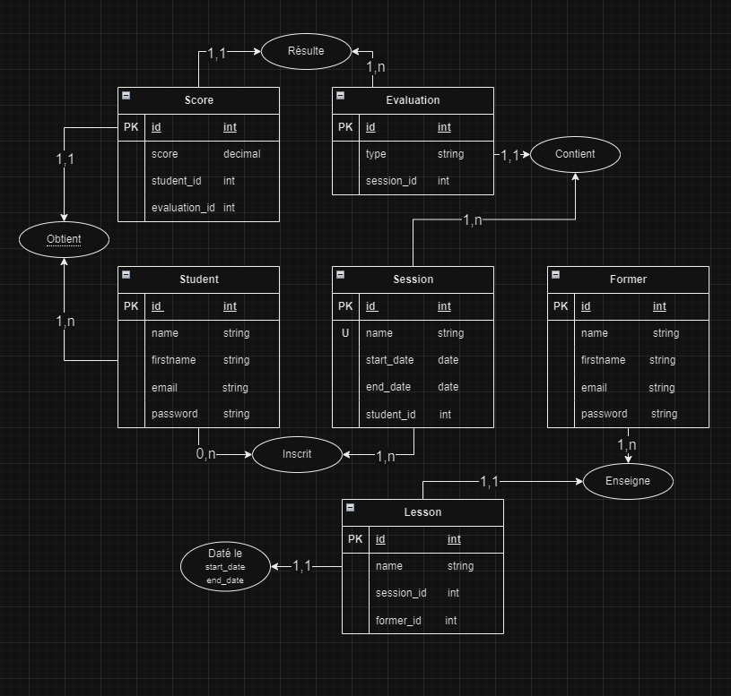

# Évaluation

## Cas pratique : Mise en place d'un LMS (Learning Management System)

Expression des besoins du client : 

Le client souhaite faire développer un site/application permettant de gérer toutes les ressources pédagogiques. Les étudiants et formateurs pourront s'inscrire dessus et s'y connecter grâce à leurs identifiants (email, mot de passe). 

Un étudiant fait partie d'une seule session à la fois. Les formateurs peuvent donner cours à plusieurs sessions. Chaque session sera composée de différents cours qui auront un nom (par exemple Symfony) et une date (par exemple du 01/01 au 05/01) de manière à pouvoir créer un emploi du temps, que l'étudiant pourra consulter à chaque instant. Une session doit avoir un nom unique pour qu'on puisse la retrouver facilement. La plateforme permettra aux étudiants d'afficher tout le contenu des cours. Pour chaque session on pourra afficher la liste des étudiants qui la composent ainsi qu'un "trombinoscope" (toutes les photos de tous les étudiants de la session).

Les formateurs peuvent créer des évaluations directement sur la plateforme. Ces évaluations pourront être de différents types (qcm, tp...). Les formateurs peuvent donner des notes aux étudiants sur ces évaluations.

## Travail à réaliser

Réaliser un MCD (une image) qui représentera l'ensemble des données de ce projet, un MLD (un fichier texte) avec la liste de toutes les tables et leurs relations, un script SQL pour mettre en place cette base de données.

Le travail sera déposé sur un dépôt github public. L'url du dépôt peut être déposé à cette [url](https://docs.google.com/spreadsheets/d/1FG3mYVUH5kBjLPXZZQVMIb7DD8_pxTwnOaADXVqViBk/edit#gid=0).


## MCD



## MLD

- Student (id INT, name STRING, firstname STRING, email STRING, password STRING)
- Former (id INT, name STRING, firstname STRING, email STRING, password STRING)
- Session (id INT, name STRING, start_date DATE, end_date DATE, student_id INT)
- Lesson (id INT, name STRING, session_id INT, former_id INT)
- LessonDate (id INT, start_date DATETIME, end_date DATETIME)
- Evaluation (id INT, type STRING, session_id INT)
- Score (id INT, score DECIMAL, student_id INT, evaluation_id INT)

## SQL

```sql
-- Création de la table Student
CREATE TABLE student (
    id INT PRIMARY KEY,
    name VARCHAR(255),
    firstname VARCHAR(255),
    email VARCHAR(255),
    password VARCHAR(255)
);

-- Création de la table Former
CREATE TABLE former (
    id INT PRIMARY KEY,
    name VARCHAR(255),
    firstname VARCHAR(255),
    email VARCHAR(255),
    password VARCHAR(255)
);

-- Création de la table Session
CREATE TABLE session (
    id INT PRIMARY KEY,
    name VARCHAR(255) UNIQUE,
    start_date DATE,
    end_date DATE,
    student_id INT,
    FOREIGN KEY (student_id) REFERENCES student(id)
);

-- Création de la table Lesson
CREATE TABLE lesson (
    id INT PRIMARY KEY,
    name VARCHAR(255),
    session_id INT,
    former_id INT,
    FOREIGN KEY (session_id) REFERENCES session(id),
    FOREIGN KEY (former_id) REFERENCES former(id)
);

-- Création de la table Lesson Date
CREATE TABLE lesson_date (
    id INT PRIMARY KEY,
    lesson_id INT,
    start_date DATETIME,
    end_date DATETIME,
    FOREIGN KEY (lesson_id) REFERENCES lesson(id),
);

-- Création de la table Evaluation
CREATE TABLE evaluation (
    id INT PRIMARY KEY,
    type VARCHAR(255),
    session_id INT,
    FOREIGN KEY (session_id) REFERENCES session(id)
);

-- Création de la table Score
CREATE TABLE score (
    id INT PRIMARY KEY,
    score DECIMAL(10, 2),
    student_id INT,
    evaluation_id INT,
    FOREIGN KEY (student_id) REFERENCES student(id),
    FOREIGN KEY (evaluation_id) REFERENCES evaluation(id)
);
```